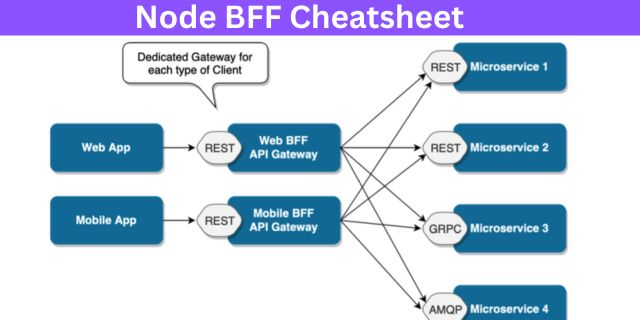

# Node.js BFF Architecture — CheatSheet



A complete reference on the **Backend for Frontend (BFF)** pattern using Node.js — covering foundational theory, production code patterns, Node-RED as a visual BFF, mobile-specific patterns, and microfrontend integration with Rspack.

---

## Documents in This Repository

| File | What it covers |
|---|---|
| [NODE_BFF_ARCHITECTURE.md](#1-node_bff_architecturemd) | Theory — what BFF is, why it exists, significance, when to use it |
| [NODE_BFF_CHEATSHEET.md](#2-node_bff_cheatsheetmd) | Code — 10 production patterns, best practices, folder structure |
| [NODE_RED_BFF_APPROACH.md](#3-node_red_bff_approachmd) | Node-RED as a visual/low-code BFF tool |
| [MOBILE_BFF_PATTERNS.md](#4-mobile_bff_patternsmd) | Mobile-specific BFF patterns — SDUI, caching, token passthrough |
| [MFE_BFF_RSPACK.md](#5-mfe_bff_rspackmd) | BFF in Microfrontend architecture with Rspack Module Federation |

---

## 1. [NODE_BFF_ARCHITECTURE.md](NODE_BFF_ARCHITECTURE.md)

**The foundational theory document.** Start here if you are new to BFF.

### What is BFF?
A dedicated backend service created for a specific frontend client (web, mobile, TV). Coined by **Sam Newman** (*Building Microservices*). Each frontend gets its own backend shaped exactly to its needs, instead of a single shared API serving everyone.

```
Without BFF                         With BFF
[Web App]  ──────┐                  [Web App]  ──── [Web BFF]    ──┐
[iOS App]  ──────┼──► [API]         [iOS App]  ──── [Mobile BFF] ──┼──► [Microservices]
[Android]  ──────┘                  [Android]  ──── [Mobile BFF] ──┘
```

### Why BFF Exists
A single shared API serving all client types leads to:

| Problem | Impact |
|---|---|
| Over-fetching | Mobile receives fields it never uses |
| Under-fetching | Web makes 5 calls to assemble one screen |
| Versioning hell | A mobile change forces a web deploy |
| Shared release cycles | Teams block each other |

### 7 Areas of Significance
1. **Client-optimized data contracts** — BFF owns the response shape per screen
2. **Team autonomy** — frontend team evolves their BFF without coordinating with others
3. **Security boundary** — validates tokens, strips sensitive fields, enforces CORS
4. **Protocol translation** — clients speak REST/GraphQL; BFF speaks gRPC/AMQP to services
5. **Fault isolation** — a broken downstream service affects only one BFF, not all clients
6. **Performance** — client makes 1 call; BFF fans out to N services in parallel internally
7. **Feature flags / A/B experiments** — evaluated in the BFF, not on-device

### When to Use / Not Use
Use when you have multiple distinct client types and microservices. Skip it for single-client apps, simple CRUD, or small teams where the overhead isn't justified.

### BFF vs API Gateway
They are **complementary**, not alternatives. API Gateway handles cross-cutting infra (routing, TLS, rate limits); BFF handles client-specific aggregation and transformation. A typical chain: `[Client] → [API Gateway] → [BFF] → [Microservices]`.

### Why Node.js
Non-blocking I/O matches BFF's I/O-heavy workload, JSON is native, TypeScript is shared with the frontend, and the ecosystem (Fastify, NestJS, Apollo Server) is best-in-class for BFF use cases.

**Recommended stack:** Fastify/NestJS/Express · Axios/undici · Apollo Server · ioredis · jose · Zod · OpenTelemetry + Pino

---

## 2. [NODE_BFF_CHEATSHEET.md](NODE_BFF_CHEATSHEET.md)

**The hands-on reference.** Production-ready TypeScript code for every common BFF pattern.

### Project Setup
Minimal Express + TypeScript scaffold and Fastify alternative, including `tsconfig.json`.

### 10 Core Code Patterns

| # | Pattern | What it solves |
|---|---|---|
| 1 | **Service Aggregation** | Fan out to multiple services, combine into one screen-specific response |
| 2 | **Request Forwarding / Proxy** | Axios factory with interceptors — internal auth token, error normalization |
| 3 | **Response Shaping** | Transformer functions strip internal fields, rename keys, convert units |
| 4 | **Parallel Fan-Out** | `Promise.all` vs `Promise.allSettled` — serial vs parallel latency comparison |
| 5 | **Circuit Breaker** | opossum — auto-open on error threshold, fallback values, state change events |
| 6 | **Caching Layer** | Redis `cached()` helper with TTL + cache invalidation on mutation |
| 7 | **Auth Middleware** | JWT verification via `jose` + JWKS, `requireRole` factory guard |
| 8 | **Rate Limiting** | Redis-backed global + per-route limits keyed on `userId` not IP |
| 9 | **Error Normalization** | Global Express error handler — 5xx messages sanitized, `requestId` included |
| 10 | **GraphQL BFF** | Apollo Server + Express — resolver-level fan-out, only fetches fields the client requests |

### Best Practices Summary
- Shape responses for the screen, not the domain
- `Promise.allSettled` for non-critical data — partial responses beat total failures
- Set timeouts on every downstream call
- BFF is the auth boundary — validate tokens here, strip sensitive fields in transformers
- Structured logging with Pino — never `console.log`
- Thread `X-Request-Id` through every downstream call

### Recommended Folder Structure
```
src/
├── routes/        # one file per screen/feature
├── services/      # HTTP clients per downstream service
├── transformers/  # raw domain → client shape
├── middleware/    # auth, rate-limit, error-handler
├── cache/         # Redis helpers
└── graphql/       # optional — Apollo Server setup
```

---

## 3. [NODE_RED_BFF_APPROACH.md](NODE_RED_BFF_APPROACH.md)

**Node-RED as a visual, low-code BFF layer.** Based on *"Node-RED: A Practical BFF Approach"* by Swagata Acharyya (April 2025).

### What is Node-RED?
A flow-based programming tool built on Express.js. Data pipelines are wired visually as connected **nodes** — each node transforms a `msg` object. Originally built for IoT; now widely used for rapid BFF prototyping.

### The Wedding Planner Analogy
> *"A BFF is like a wedding planner — handles all the backend chaos so the frontend can focus on the experience."*

The planner (BFF) coordinates vendors (microservices) and delivers one coherent event (response), hiding all supplier negotiation from the couple (frontend).

### Why Node-RED for BFF
A mobile dashboard requiring data from User, Wallet, Accounts, Loans, and Deposits services would force 5 client-side calls. Node-RED BFF reduces this to **1 call** — it fans out to all 5 services in parallel via Split/Join nodes and returns a single shaped response.

### Node-RED Architecture
- **Express HTTP server** handles incoming requests
- **Flow Engine** routes messages between nodes
- **`msg` object** carries `payload`, `req`, `res`, `headers` through the flow
- **Function nodes** hold custom JavaScript logic (`msg.payload = ...; return msg;`)
- **Local/Global context** for in-flow state and cross-flow caching

### 5 Node-RED BFF Patterns
| Pattern | Description |
|---|---|
| Token Injection | Intercept client auth header, inject `X-Internal-Token` into downstream requests |
| Response Shaping | Function node strips internal fields, renames keys for client |
| Conditional Routing | Switch node routes to different service URLs by account type or region |
| Error Handling | Catch node creates a dedicated error branch with normalized error response |
| Caching with Flow Context | `flow.get`/`flow.set` as cache-aside; Redis context store for persistence |

### Real-World Use Cases
Dashboard aggregation, session token management, **Server-Driven UI** (BFF returns component layout spec), A/B test routing — all without a client-side app store release.

### Node-RED vs Custom Node.js BFF
| | Node-RED | Express/Fastify |
|---|---|---|
| Setup | Minutes | Hours |
| Complex logic | Awkward | Native |
| Testability | Limited | Full |
| Best for | Rapid aggregation, SDUI | High-throughput, complex transforms |

### Production
PM2 cluster mode, disable editor in production, Redis context store for shared state across cluster nodes, commit `flows.json` to git for version control.

---

## 4. [MOBILE_BFF_PATTERNS.md](MOBILE_BFF_PATTERNS.md)

**Mobile-specific BFF patterns.** Applicable to any Node.js BFF (Node-RED, Express, Fastify, NestJS).

### The Mobile BFF Problem — Latency Math
```
Without BFF (parallel, 4G, 80ms RTT):  5 calls × ~80ms overhead = ~360ms + 5 radio activations
With BFF:                               1 call to BFF + ~280ms internal fan-out = ~360ms, 1 radio activation
```
Same total latency, but 1 error surface instead of 5, pre-shaped payload, and graceful degradation if one service fails.

### 8 Mobile BFF Patterns

| # | Pattern | Key technique |
|---|---|---|
| 1 | **Dashboard Aggregation** | `Promise.allSettled` + `fulfilled()` helper returns fallback on rejection |
| 2 | **Session Token Passthrough** | BFF validates JWT, attaches `rawToken` for downstream audit; app never manages service auth |
| 3 | **Server-Driven UI (SDUI)** | BFF returns a `components[]` array with `type`, `data`, `action` — mobile client is a pure renderer |
| 4 | **Partial Success / Graceful Degradation** | Critical service failure → error; non-critical failure → `null` + `_warnings[]` |
| 5 | **Mobile-Specific Response Shaping** | Masked account numbers (`last4`), display-ready `formatCurrency()`, strip audit fields |
| 6 | **Offline-Friendly Caching** | `ETag` + `Cache-Control: stale-while-revalidate` for native HTTP layer; Redis SWR for server-side |
| 7 | **A/B Testing & Feature Flags** | Evaluate LaunchDarkly/Unleash flags in BFF — change behavior without app store release |
| 8 | **Pagination Translation** | Cursor-based service pagination → page-based response the mobile client expects |

### Mobile vs Web BFF — Key Differences
| Concern | Mobile | Web |
|---|---|---|
| Payload | Minimize aggressively | Richer is fine |
| Auth | JWT in header | Session cookie + CSRF |
| Response | Display-ready strings | Raw values |
| Layout | SDUI — server decides | Frontend decides |
| Versioning | Critical — old apps stay in field | Less critical |

### Versioning Strategy
Semver-route in the BFF (`semver.lt(appVersion, '3.0.0') → v1 handler`) or URL versioning (`/v1/home`, `/v2/home`). Mark deprecated routes with `Sunset` and `Deprecation` headers.

---

## 5. [MFE_BFF_RSPACK.md](MFE_BFF_RSPACK.md)

**BFF in a Microfrontend architecture with Rspack Module Federation 2.0.**

### Two Architecture Models

**Model A — Dedicated BFF per MFE (recommended):** Each Rspack remote (Catalog, Cart, Checkout) has its own BFF service. MFEs only talk to their own BFF. Teams deploy frontend + BFF together in the same CI pipeline.

**Model B — Shared BFF with path routing:** One BFF routes by path prefix (`/catalog/*`, `/cart/*`). Simpler, but less autonomous.

### Team Ownership Model
```
teams/
├── catalog/
│   ├── frontend/   ← Rspack remote
│   └── bff/        ← Catalog BFF (same repo, same pipeline)
├── cart/
└── shell/
    ├── frontend/   ← Rspack host
    └── bff/        ← owns auth/session
```

### Rspack Module Federation Setup
- **Host (shell):** `ModuleFederationPlugin` with `remotes` pointing to env-var CDN URLs, `shared: { react: { singleton: true }, '@acme/bff-client': { singleton: true } }`
- **Remote:** `exposes` components, `uniqueName` required for MF 2.0, `publicPath: 'auto'`
- **Type safety:** `@module-federation/dts-plugin` generates types across remote boundaries
- **Lazy loading in shell:** `lazy(() => import('catalog/App'))` inside `<Suspense>`

### BFF Routing
nginx upstream config routes `/api/catalog/` → Catalog BFF, `/api/cart/` → Cart BFF, etc. A shared `@acme/bff-client` Axios factory auto-injects auth headers and routes to the correct base URL per domain.

### Shared Auth
The Shell BFF owns the `/session` endpoint. On boot, the shell loads user context and feature flags, populates a **Module Federation singleton `authStore`**, and all remotes consume it via `useAuth()` — no token management per MFE.

### Cross-MFE Data Sharing (without coupling BFFs)
- **Custom DOM events:** `window.dispatchEvent(new CustomEvent('cart:updated', { detail }))` — loose coupling, no shared dependency
- **MF state singleton:** `cartState` exposed by the cart remote, shared as MF singleton — remotes subscribe to updates

### Contract-First Design
Each team publishes a **Zod schema package** (`@acme/catalog-contract`). The BFF validates its outgoing response against the schema (`ProductListSchema.parse(...)`) before sending. The MFE validates the incoming response on receipt. Contract drift surfaces immediately at runtime.

### Error Handling Consistency
All BFFs share one `errorHandler` middleware from `@acme/bff-utils`. All errors return the same envelope: `{ error: { message, code, requestId } }`. The shared `@acme/bff-client` maps all non-2xx responses to a typed `BffRequestError`.

### Distributed Tracing
Shell generates `X-Trace-Id` (session-scoped) and injects it into every request. BFFs thread it through to downstream service calls. `x-mfe-name` header identifies which MFE made the call. Pino child loggers attach `traceId + requestId + mfe` to every log line.

### Best Practices Checklist (30 items across 4 categories)
- **Architecture:** BFF co-deployed with MFE, no cross-MFE BFF calls, shell owns auth, contracts as packages
- **Rspack/MF:** `singleton: true` on all shared libs, `eager: true` only on auth store, env-var remote URLs
- **BFF Design:** Zod-validate responses before sending, shared error middleware, timeouts on all calls
- **Security:** CORS restricted to shell origin, Helmet on all BFFs, rate limit by `userId` not IP

### Common Pitfalls
Shared BFF for multiple MFEs, MFE calling sibling BFF, missing `singleton: true`, hardcoded remote URLs, contract drift, different error shapes, no trace propagation, `eager: true` on large libs, BFF deployed out of sync with MFE.

---

## Quick Decision Guide

```
Q: Do I need a BFF at all?
   → Single client type, simple CRUD?      → No. Use a plain REST/GraphQL API.
   → Multiple client types + microservices? → Yes. Start here.

Q: Which approach fits my team?
   → Small team, need rapid prototyping?   → Node-RED BFF
   → High throughput, full test coverage?  → Custom Node.js (Express/Fastify/NestJS)
   → Independent frontend teams (MFE)?     → Dedicated BFF per MFE with Rspack MF

Q: What if I build for mobile?
   → Always one endpoint per screen
   → Evaluate feature flags in the BFF, not on-device
   → Return display-ready strings, not raw domain values
   → Plan for response versioning before you ship v1
```

---

## Reading Order

1. [NODE_BFF_ARCHITECTURE.md](NODE_BFF_ARCHITECTURE.md) — understand the pattern and its value
2. [NODE_BFF_CHEATSHEET.md](NODE_BFF_CHEATSHEET.md) — implement it with production code snippets
3. [NODE_RED_BFF_APPROACH.md](NODE_RED_BFF_APPROACH.md) — explore the visual/low-code alternative
4. [MOBILE_BFF_PATTERNS.md](MOBILE_BFF_PATTERNS.md) — go deeper on mobile-specific constraints
5. [MFE_BFF_RSPACK.md](MFE_BFF_RSPACK.md) — integrate BFF into a Microfrontend system with Rspack
